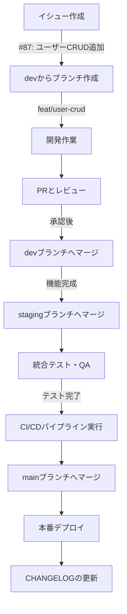
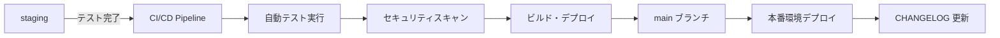

# 🌿 ブランチ管理ガイドライン

このガイドラインは、効率的なブランチ管理とチーム開発のためのルールを定めています。

## 🛡️ メインブランチの保護

### 重要なルール

- ⛔ **main ブランチへの直接プッシュは禁止**
  - リポジトリの安定性を保つため
  - 緊急時の復旧を容易にするため

### 推奨される作業フロー

1. 🎯 イシューに関連する作業用ブランチを`dev`から作成
2. 💻 作業用ブランチで開発を実施
3. 🔄 `dev`ブランチへのマージ（開発環境用）
4. 🚀 `staging`ブランチでのリリース準備・テスト
5. ✅ CI/CD を通して`main`へのマージ・本番デプロイ

## 📝 ブランチ命名規則

### 基本フォーマット

```md
<type>/<description>
```

### 📋 Type 一覧

| Type     | 説明                 | 例                         |
| -------- | -------------------- | -------------------------- |
| feat     | 新機能の追加         | feat/add-user-registration |
| fix      | バグ修正             | fix/login-error            |
| docs     | ドキュメントの更新   | docs/update-readme         |
| style    | コードスタイルの修正 | style/fix-indentation      |
| refactor | リファクタリング     | refactor/auth-process      |
| perf     | パフォーマンス改善   | perf/optimize-query        |
| test     | テストの追加・修正   | test/add-user-tests        |
| build    | ビルドシステムの変更 | build/update-dockerfile    |
| ci       | CI 関連の変更        | ci/github-actions          |
| chore    | その他の変更         | chore/update-dependencies  |

### 📌 命名のルール

1. **区切り文字**

   - Type と説明の間: `/`
   - 説明の単語間: `-`

2. **説明部分のルール**
   - ✅ 英語の小文字のみ使用
   - ✅ 単語間は `-` で区切る
   - ✅ 簡潔で分かりやすい説明
   - ✅ 50 文字以内を推奨
   - ✅ 必要に応じてイシュー番号を含める

### ✨ 良い例

```md
feat/add-user-authentication
fix/resolve-login-error
docs/update-api-docs
feat/auth-system-issue-123
```

### ❌ 悪い例

```markdown
feature_add_authentication # 不適切な区切り文字
fix-login # Type の後のスラッシュがない
ADD-USER # 大文字使用、Type 不明
feat/Add_User # 不適切な区切り文字と大文字
```

## 🔄 ブランチワークフロー例



## 🌿 ブランチ戦略詳細

### メインブランチ構成

| ブランチ名 | 用途             | 環境        | 保護レベル |
| ---------- | ---------------- | ----------- | ---------- |
| `main`     | 本番環境         | Production  | 🔒 最高    |
| `staging`  | ステージング環境 | Staging     | 🔒 高      |
| `dev`      | 開発環境         | Development | 🔒 中      |

### ブランチ運用ルール

#### 1. 開発ブランチ（Feature/Fix ブランチ）

- **作成元**: 必ず`dev`ブランチから作成
- **命名規則**: `<type>/<description>` （例: `feat/user-authentication`）
- **マージ先**: `dev`ブランチのみ
- **ライフサイクル**: 機能完成後に削除

```bash
# 開発ブランチの作成例
git checkout dev
git pull origin dev
git checkout -b feat/user-authentication
```

#### 2. dev ブランチ

- **用途**: 開発中の機能を統合
- **環境**: 開発環境（Development）
- **更新頻度**: 日次〜週次
- **テスト**: 基本的な動作確認

#### 3. staging ブランチ

- **用途**: リリース前の最終確認
- **環境**: ステージング環境（本番環境と同等）
- **更新頻度**: リリース前
- **テスト**: 統合テスト、QA、パフォーマンステスト

```bash
# stagingブランチへのマージ例
git checkout staging
git pull origin staging
git merge dev
git push origin staging
```

#### 4. main ブランチ

- **用途**: 本番環境
- **環境**: Production
- **更新頻度**: リリース時のみ
- **制約**: CI/CD パイプラインを通してのみマージ可能

## 🚀 CI/CD パイプライン

### リリースフロー



### CI/CD 必須要件

#### 1. 自動テスト

- **ユニットテスト**: 全テストが成功すること
- **統合テスト**: API テストが成功すること
- **E2E テスト**: 主要ユーザーフローが正常動作すること
- **テストカバレッジ**: 80% 以上を維持すること

#### 2. セキュリティチェック

- **依存関係スキャン**: 脆弱性のある依存関係がないこと
- **静的解析**: セキュリティ上の問題がないこと
- **シークレット検出**: ハードコードされた機密情報がないこと

#### 3. 品質チェック

- **Lint チェック**: コードスタイルガイドラインに準拠すること
- **型チェック**: TypeScript の型エラーがないこと
- **パフォーマンステスト**: 性能劣化がないこと

### バージョン管理とリリース

#### 1. バージョニング

- **Semantic Versioning** を採用
- **MAJOR.MINOR.PATCH** 形式（例: 1.2.3）
- **Breaking Changes**: MAJOR バージョンアップ
- **新機能**: MINOR バージョンアップ
- **バグ修正**: PATCH バージョンアップ

#### 2. リリース手順

```bash
# 1. stagingブランチでの最終確認
git checkout staging
git pull origin staging

# 2. CI/CDパイプラインの実行確認
# GitHub Actions で自動実行される

# 3. mainブランチへのマージ（CI/CD経由のみ）
# プルリクエスト作成 → CI/CD成功 → 自動マージ

# 4. CHANGELOGの更新
git checkout main
git pull origin main
# CHANGELOG.md を編集
git add CHANGELOG.md
git commit -m "docs: update CHANGELOG for v1.2.3"
git push origin main

# 5. タグの作成
git tag v1.2.3
git push origin v1.2.3
```

#### 3. CHANGELOG 更新ルール

- **リリース前**: staging → main マージ後に必ず更新
- **フォーマット**: [Keep a Changelog](https://keepachangelog.com/ja/1.0.0/) に準拠
- **内容**: 追加・変更・修正・削除・セキュリティの分類で記載
- **リンク**: GitHub リリースページへのリンクを追加

例：

```markdown
## [1.2.3] - 2024-02-15

### 追加

- ユーザー認証機能を追加 (#123)
- パスワードリセット機能を実装 (#124)

### 修正

- ログイン時のメモリリークを修正 (#128)
- モバイル表示の崩れを修正 (#129)

### セキュリティ

- JWT トークンの有効期限を短縮 (#130)
```

## 👥 レビュープロセス

### レビュワー

以下の 2 名のレビュー承認が必要です：

- [レビュワー 1 の名前]
- [レビュワー 2 の名前]

### ブランチ別レビュー要件

| マージ先  | 必要レビュワー数 | 追加要件               |
| --------- | ---------------- | ---------------------- |
| `dev`     | 1 名以上         | 基本的なコードレビュー |
| `staging` | 2 名以上         | 統合テスト確認         |
| `main`    | 自動（CI/CD）    | 全自動テスト成功       |

### レビュー依頼時の注意点

1. **コードの品質確認**

   - コーディング規約への準拠
   - 適切なコメントの記載
   - パフォーマンスへの配慮

2. **テストの実施確認**

   - 新規機能のテスト追加
   - 既存テストの実行確認
   - テストカバレッジの維持

3. **ドキュメントの更新確認**

   - API ドキュメントの更新
   - README の更新（必要に応じて）
   - コメントの適切な記載

4. **セキュリティの確認**
   - 入力値検証の実装
   - 認証・認可の適切な実装
   - 機密情報の適切な取り扱い
