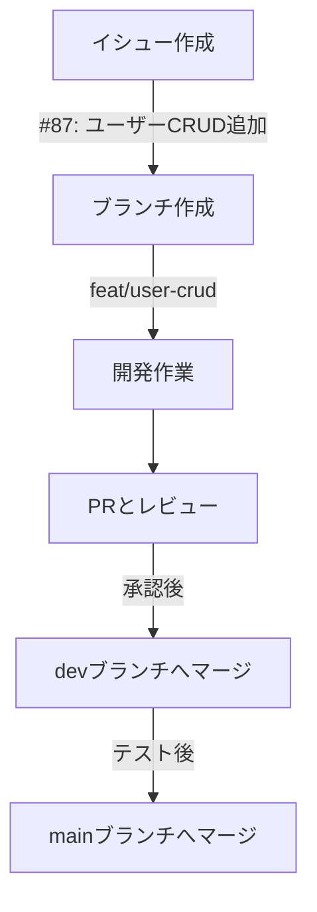

# 🌿 ブランチ管理ガイドライン

このガイドラインは、効率的なブランチ管理とチーム開発のためのルールを定めています。

## 🛡️ メインブランチの保護

### 重要なルール

- ⛔ **main ブランチへの直接プッシュは禁止**
  - リポジトリの安定性を保つため
  - 緊急時の復旧を容易にするため

### 推奨される作業フロー

1. 🎯 イシューに関連する作業用ブランチを作成
2. 💻 作業用ブランチで開発を実施
3. 🔄 `dev`ブランチへのマージ（開発環境用）
4. ✅ テスト後、`main`へのマージ

## 📝 ブランチ命名規則

### 基本フォーマット

```md
<type>/<description>
```

### 📋 Type 一覧

| Type     | 絵文字 | 説明                 | 例                         |
| -------- | ------ | -------------------- | -------------------------- |
| feat     | ✨     | 新機能の追加         | feat/add-user-registration |
| fix      | 🐛     | バグ修正             | fix/login-error            |
| docs     | 📚     | ドキュメントの更新   | docs/update-readme         |
| style    | 💅     | コードスタイルの修正 | style/fix-indentation      |
| refactor | ♻️     | リファクタリング     | refactor/auth-process      |
| perf     | ⚡     | パフォーマンス改善   | perf/optimize-query        |
| test     | 🧪     | テストの追加・修正   | test/add-user-tests        |
| build    | 🏗️     | ビルドシステムの変更 | build/update-dockerfile    |
| ci       | 🤖     | CI 関連の変更        | ci/github-actions          |
| chore    | 🔧     | その他の変更         | chore/update-dependencies  |

### 📌 命名のルール

1. **区切り文字**

   - Type と説明の間: `/`
   - 説明の単語間: `-`

2. **説明部分のルール**
   - ✅ 英語の小文字のみ使用
   - ✅ 単語間は `-` で区切る
   - ✅ 簡潔で分かりやすい説明
   - ✅ 50 文字以内を推奨
   - ✅ 必要に応じてイシュー番号を含める

### ✨ 良い例

```md
feat/add-user-authentication
fix/resolve-login-error
docs/update-api-docs
feat/auth-system-issue-123
```

### ❌ 悪い例

```md
feature_add_authentication # 不適切な区切り文字
fix-login # Type の後のスラッシュがない
ADD-USER # 大文字使用、Type 不明
feat/Add_User # 不適切な区切り文字と大文字
```

## 🔄 ブランチワークフロー例



## 👥 レビュープロセス

### レビュワー

以下の 2 名のレビュー承認が必要です：

-
-

### レビュー依頼時の注意点

1. コードの品質確認
2. テストの実施確認
3. ドキュメントの更新確認
