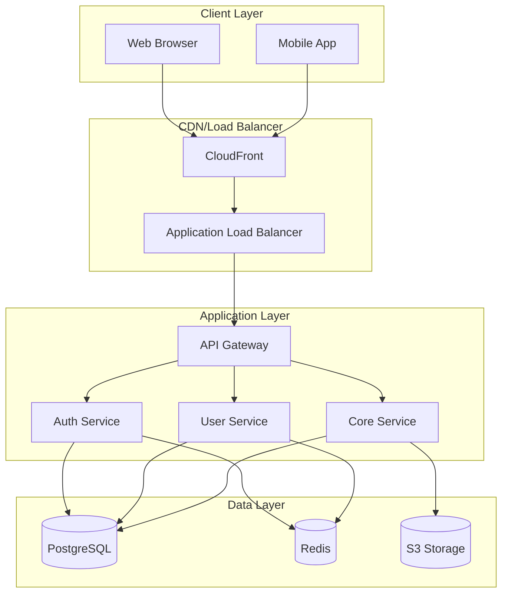
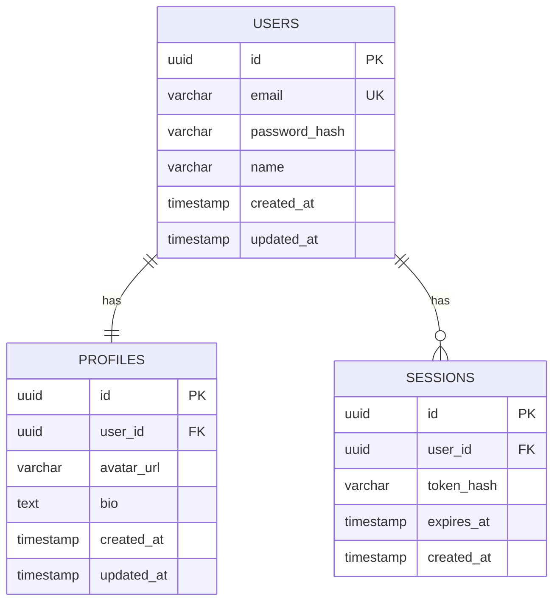
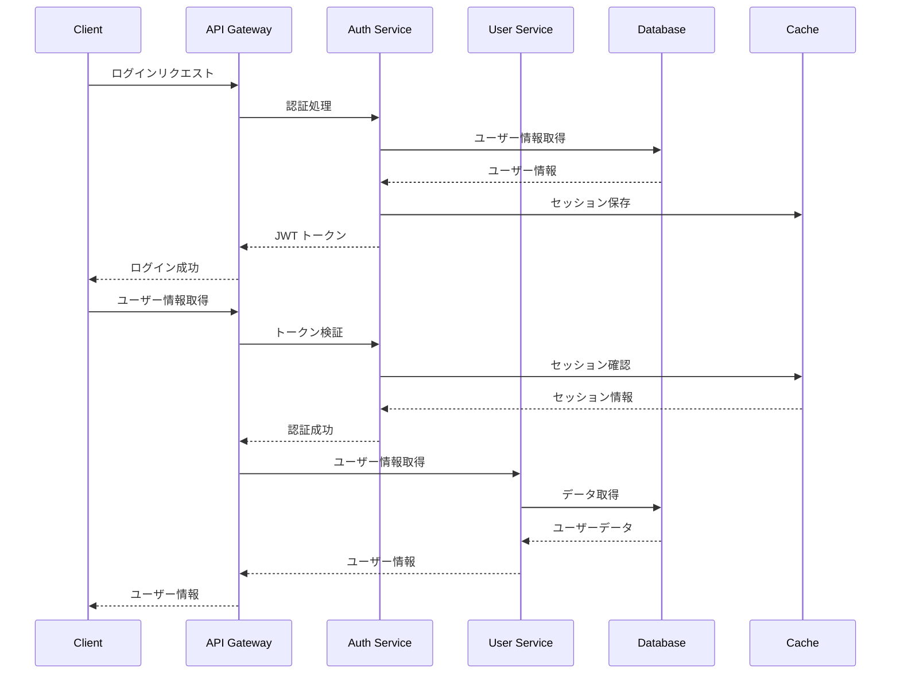
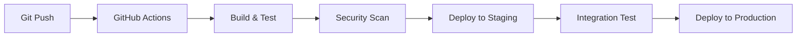

# システムアーキテクチャ設計書

## 1. 概要

### 1.1 文書の目的

本文書は、システムの全体的なアーキテクチャ設計について記述し、開発チーム全体での共通理解を図ることを目的としています。

### 1.2 対象読者

- 開発チーム
- アーキテクト
- プロジェクトマネージャー
- インフラエンジニア

### 1.3 システム概要

[システムの概要を記載]

## 2. アーキテクチャ概要

### 2.1 アーキテクチャパターン

- **パターン**: 3 層アーキテクチャ + マイクロサービス
- **理由**: スケーラビリティと保守性の向上

### 2.2 システム全体図

## 3. システム構成要素

### 3.1 フロントエンド

#### 3.1.1 Web アプリケーション

- **技術スタック**: React.js + TypeScript
- **状態管理**: Redux Toolkit
- **UI ライブラリ**: Material-UI
- **ビルドツール**: Vite
- **テスト**: Jest + React Testing Library

#### 3.1.2 モバイルアプリケーション

- **技術スタック**: React Native + TypeScript
- **状態管理**: Redux Toolkit
- **ナビゲーション**: React Navigation
- **テスト**: Jest + Detox

### 3.2 バックエンド

#### 3.2.1 API Gateway

- **技術**: AWS API Gateway
- **機能**:
  - リクエストルーティング
  - レート制限
  - 認証・認可
  - ログ記録

#### 3.2.2 認証サービス

- **技術**: Node.js + Express + TypeScript
- **機能**:
  - ユーザー認証
  - JWT トークン発行
  - パスワードリセット
  - OAuth 連携

#### 3.2.3 ユーザーサービス

- **技術**: Node.js + Express + TypeScript
- **機能**:
  - ユーザー情報管理
  - プロフィール管理
  - アカウント設定

#### 3.2.4 コアサービス

- **技術**: Node.js + Express + TypeScript
- **機能**:
  - ビジネスロジック
  - データ処理
  - 外部 API 連携

### 3.3 データベース

#### 3.3.1 メインデータベース

- **技術**: PostgreSQL 14
- **構成**: マスター・スレーブ構成
- **バックアップ**: 日次自動バックアップ

#### 3.3.2 キャッシュ

- **技術**: Redis 6
- **用途**:
  - セッション管理
  - 頻繁にアクセスされるデータのキャッシュ
  - レート制限カウンター

#### 3.3.3 ファイルストレージ

- **技術**: AWS S3
- **用途**:
  - ユーザーアップロードファイル
  - 静的アセット
  - バックアップファイル

## 4. データアーキテクチャ

### 4.1 データベース設計

#### 4.1.1 ER 図

#### 4.1.2 テーブル設計

##### users テーブル

| カラム名      | データ型     | 制約             | 説明               |
| ------------- | ------------ | ---------------- | ------------------ |
| id            | UUID         | PRIMARY KEY      | ユーザー ID        |
| email         | VARCHAR(255) | UNIQUE, NOT NULL | メールアドレス     |
| password_hash | VARCHAR(255) | NOT NULL         | パスワードハッシュ |
| name          | VARCHAR(100) | NOT NULL         | ユーザー名         |
| created_at    | TIMESTAMP    | NOT NULL         | 作成日時           |
| updated_at    | TIMESTAMP    | NOT NULL         | 更新日時           |

### 4.2 データフロー

## 5. セキュリティアーキテクチャ

### 5.1 認証・認可

#### 5.1.1 認証フロー

1. ユーザーがメールアドレス・パスワードでログイン
2. 認証サービスがパスワードを検証
3. JWT トークンを発行
4. クライアントがトークンを保存
5. 以降のリクエストでトークンを送信

#### 5.1.2 認可モデル

- **RBAC (Role-Based Access Control)** を採用
- ユーザーロール: `admin`, `user`, `guest`
- リソースベースの権限制御

### 5.2 セキュリティ対策

#### 5.2.1 データ保護

- **暗号化**: 機密データの AES-256 暗号化
- **ハッシュ化**: パスワードの bcrypt ハッシュ化
- **HTTPS**: 全通信の TLS 1.3 暗号化

#### 5.2.2 攻撃対策

- **SQL インジェクション**: パラメータ化クエリ
- **XSS**: 入力値のサニタイズ
- **CSRF**: CSRF トークンの使用
- **レート制限**: API の呼び出し制限

## 6. パフォーマンスアーキテクチャ

### 6.1 スケーリング戦略

#### 6.1.1 水平スケーリング

- **アプリケーション**: Auto Scaling Group
- **データベース**: Read Replica の追加
- **キャッシュ**: Redis Cluster

#### 6.1.2 垂直スケーリング

- **CPU/メモリ**: インスタンスサイズの拡張
- **ストレージ**: EBS ボリュームの拡張

### 6.2 パフォーマンス最適化

#### 6.2.1 キャッシュ戦略

- **アプリケーションレベル**: Redis キャッシュ
- **データベースレベル**: クエリ結果キャッシュ
- **CDN**: 静的コンテンツキャッシュ

#### 6.2.2 データベース最適化

- **インデックス**: 適切なインデックス設計
- **パーティショニング**: 大量データのパーティション分割
- **コネクションプール**: 接続数の最適化

## 7. 運用アーキテクチャ

### 7.1 監視・ログ

#### 7.1.1 アプリケーション監視

- **メトリクス**: CloudWatch メトリクス
- **ログ**: CloudWatch Logs
- **トレーシング**: AWS X-Ray

#### 7.1.2 インフラ監視

- **サーバー**: CloudWatch Agent
- **ネットワーク**: VPC Flow Logs
- **セキュリティ**: AWS GuardDuty

### 7.2 デプロイメント

#### 7.2.1 CI/CD パイプライン

#### 7.2.2 デプロイ戦略

- **ブルーグリーンデプロイ**: ゼロダウンタイムデプロイ
- **カナリアリリース**: 段階的なリリース
- **ロールバック**: 自動ロールバック機能

## 8. 災害復旧

### 8.1 バックアップ戦略

- **データベース**: 日次フルバックアップ + 継続的ログバックアップ
- **ファイル**: S3 Cross-Region Replication
- **設定**: Infrastructure as Code (Terraform)

### 8.2 復旧手順

1. **RTO (Recovery Time Objective)**: 4 時間以内
2. **RPO (Recovery Point Objective)**: 1 時間以内
3. **復旧優先度**: 認証 > ユーザー > その他

## 9. 技術的負債管理

### 9.1 コード品質

- **静的解析**: SonarQube
- **テストカバレッジ**: 80%以上
- **コードレビュー**: 必須

### 9.2 依存関係管理

- **セキュリティ**: Dependabot
- **ライセンス**: FOSSA
- **更新**: 定期的な依存関係更新

## 10. 今後の拡張計画

### 10.1 短期計画 (3 ヶ月)

- モバイルアプリの開発
- API の v2 リリース
- パフォーマンス最適化

### 10.2 中期計画 (6 ヶ月)

- マイクロサービス化の完了
- 機械学習機能の追加
- 多地域展開

### 10.3 長期計画 (1 年)

- サーバーレスアーキテクチャへの移行
- エッジコンピューティングの活用
- AI/ML プラットフォームの構築

---

**文書バージョン**: 1.0
**最終更新日**: [日付]
**承認者**: [承認者名]
